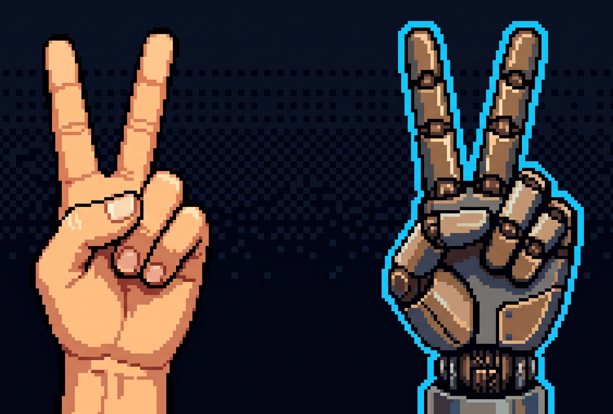

<p align="center">
  
</p>

<h1 align="center">somehand</h1>

<p align="center">
  Universal dexterous-hand retargeting with MediaPipe, MuJoCo, and configurable YAML hand models.
  <br/>
  Turn human hand motion into robot-hand targets — visualize in MuJoCo, replay offline, or drive real hardware.
</p>

<p align="center">
  <a href="docs/en/README.md">English Docs</a> •
  <a href="docs/zh/README.md">中文文档</a> •
  <a href="docs/en/getting-started.md">Getting Started</a> •
  <a href="docs/en/runtime-modes.md">CLI</a> •
  <a href="docs/en/api.md">API</a>
</p>

---

## What It Does

- Retarget hand motion from webcam, video, PICO Bridge, hc_mocap UDP, or saved recordings.
- View results in MuJoCo, run MuJoCo sim, or drive supported real hardware.
- Switch hand models through YAML configs; large runtime assets are downloaded separately.

---

## Supported Hand Models

| Company | Model | DoF | Joints |
| --- | --- | ---: | ---: |
| LinkerHand | L6 | 6 | 11 |
| LinkerHand | L10 | 10 | 20 |
| LinkerHand | L20 | 16 | 21 |
| LinkerHand | L20 Pro | 17 | 21 |
| LinkerHand | L21 | 17 | 17 |
| LinkerHand | L25 | 21 | 21 |
| LinkerHand | L30 | 20 | 20 |
| LinkerHand | LHG20 | 16 | 21 |
| LinkerHand | O6 | 6 | 11 |
| LinkerHand | O7 | 7 | 17 |
| LinkerHand | T12 | 14 | 19 |
| DexRobot | DexHand021 | 20 | 20 |
| Unitree | Dex5 | 20 | 20 |
| Inspire | DFQ | 6 | 12 |
| Inspire | FTP | 6 | 12 |
| AGIBOT | OmniHand | 10 | 16 |
| BrainCo | Revo2 | 6 | 11 |
| OYMotion | RoHand | 6 | 25 |
| Sharpa | Wave 01 | 22 | 22 |
| Wuji | Wuji Hand | 20 | 20 |

Use `configs/retargeting/{left,right,bihand}` as the source of truth for current side and bi-hand availability.

---

## CLI Quick Start

```bash
pip install "somehand[cli] @ https://github.com/BotRunner64/somehand/releases/download/v0.3.0/somehand-0.3.0-py3-none-any.whl"
somehand assets download --only mjcf mediapipe
somehand webcam
```

## API Quick Start

See [API Usage](docs/en/api.md) for stable imports, one-step retargeting, and session orchestration.

For a live camera check:

```bash
somehand webcam
```

Render a recording to MP4:

```bash
somehand dump-video \
    --recording recordings/webcam_hand.pkl \
    --output recordings/webcam_hand_replay.mp4
```

---

## Documentation

Start with the task you need:

| Task | English | 中文 |
| --- | --- | --- |
| Set up and run once | [Getting Started](docs/en/getting-started.md) | [快速开始](docs/zh/getting-started.md) |
| Run from the terminal | [CLI Usage](docs/en/runtime-modes.md) | [CLI 用法](docs/zh/runtime-modes.md) |
| Embed retargeting in Python | [API Usage](docs/en/api.md) | [API 用法](docs/zh/api.md) |
| Choose or edit a hand model config | [Configuration](docs/en/configuration.md) | [配置说明](docs/zh/configuration.md) |
| Download assets or check supported models | [Assets & Models](docs/en/assets-and-models.md) | [资产与模型](docs/zh/assets-and-models.md) |

Full indexes: [English](docs/en/README.md) / [中文](docs/zh/README.md).

## License

[Apache 2.0](LICENSE)
